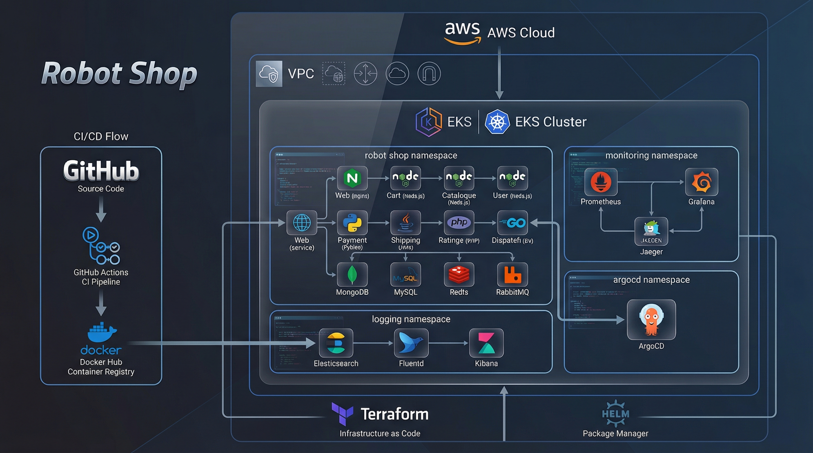
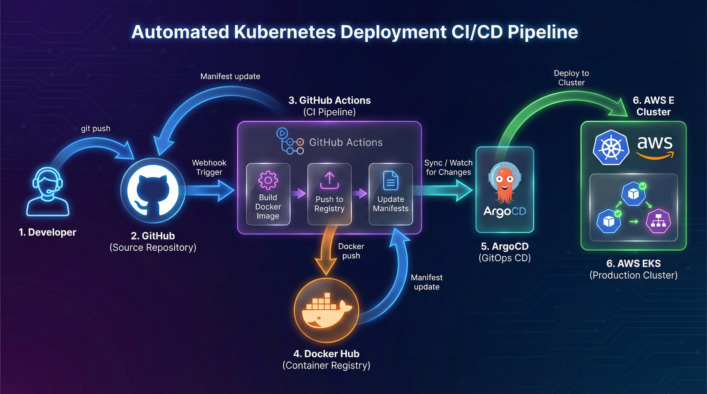
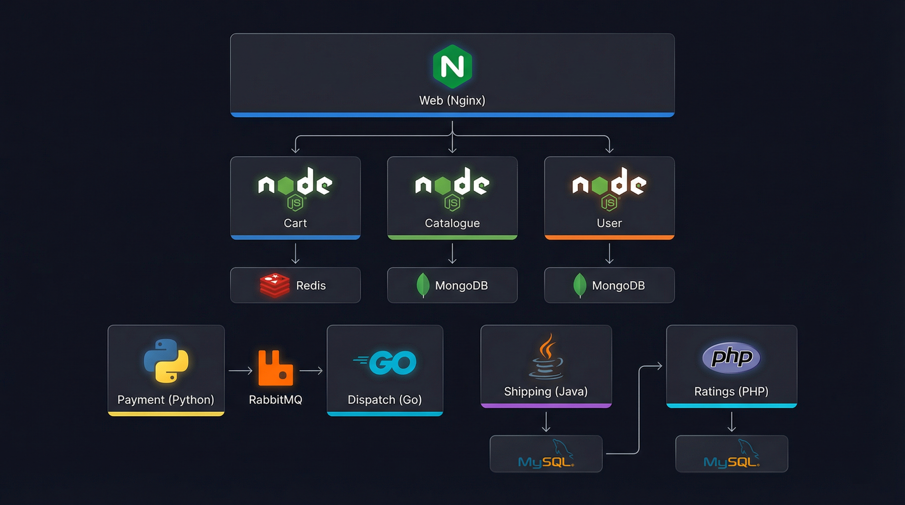
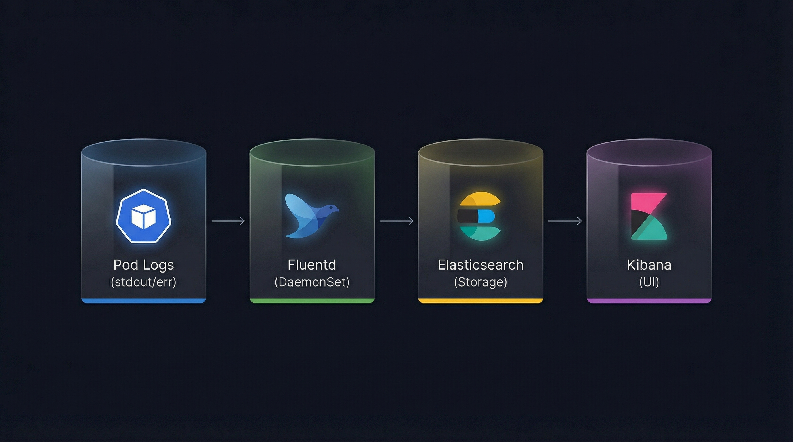
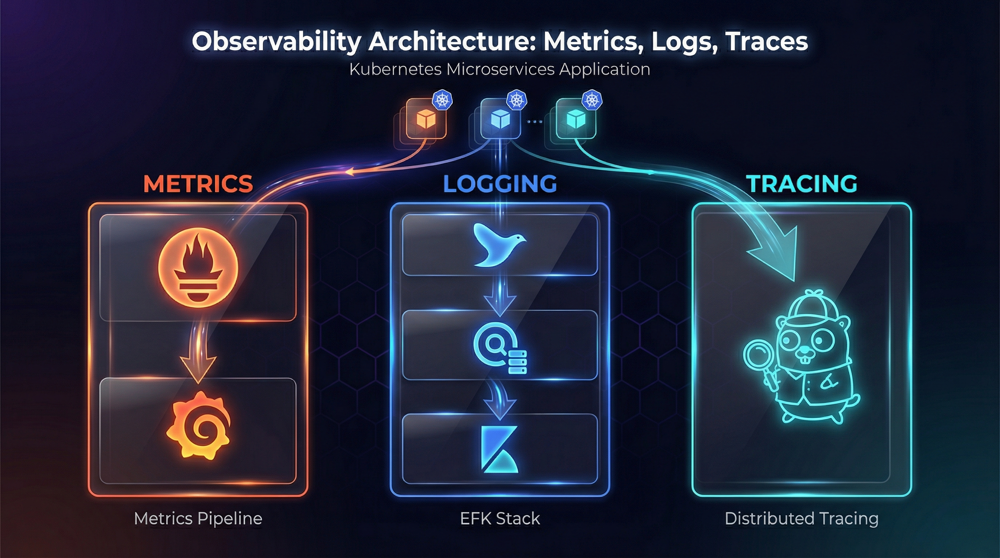

#  Robot Shop - Microservices E-Commerce Platform 🤖

A production-grade, cloud-native e-commerce application built using microservices architecture. This project demonstrates modern DevOps practices including containerization, orchestration, CI/CD automation, GitOps deployment, and full-stack observability.


---

##  Table of Contents 📋

- [Project Overview](#-project-overview)
- [Architecture](#-architecture)
- [Tech Stack](#-tech-stack)
- [Microservices](#-microservices)
- [Infrastructure](#-infrastructure)
- [CI/CD Pipeline](#-cicd-pipeline)
- [Observability Stack](#-observability-stack)
- [Getting Started](#-getting-started)
- [Deployment](#-deployment)
- [Monitoring & Logging](#-monitoring--logging)
- [Troubleshooting](#-troubleshooting)
- [Author](#-author)

---

## Project Overview 🎯

--- 

Robot Shop is a sample microservices application that simulates an e-commerce platform selling robots. The application is designed to demonstrate:

- **Microservices Architecture**: 8+ independently deployable services
- **Polyglot Development**: Services written in Node.js, Python, Java, Go, and PHP
- **Container Orchestration**: Deployed on AWS EKS using Kubernetes
- **Infrastructure as Code**: AWS resources provisioned using Terraform
- **GitOps Deployment**: Automated deployments using ArgoCD
- **CI/CD Automation**: Build and deploy pipelines using GitHub Actions
- **Full Observability**: Metrics, Logs, and Traces using Prometheus, Grafana, EFK Stack, and Jaeger

---

### High-Level Architecture



### CI/CD Pipeline Flow



## 🛠 Tech Stack

### Application Services

| Service | Language | Framework | Description |
|---------|----------|-----------|-------------|
| Web | Angular/Nginx | Nginx | Frontend web interface |
| Cart | Node.js | Express | Shopping cart management |
| Catalogue | Node.js | Express | Product catalog service |
| User | Node.js | Express | User authentication & management |
| Payment | Python | Flask | Payment processing |
| Shipping | Java | Spring Boot | Shipping cost calculation |
| Ratings | PHP | Symfony | Product ratings service |
| Dispatch | Go | Native | Order dispatch service |

### Data Services

| Service | Type | Purpose |
|---------|------|---------|
| MongoDB | NoSQL Database | User and product data |
| MySQL | Relational Database | Ratings and shipping data |
| Redis | In-Memory Cache | Session and cart caching |
| RabbitMQ | Message Broker | Async communication |

### DevOps & Infrastructure

| Tool | Purpose |
|------|---------|
| Docker | Containerization |
| Kubernetes (EKS) | Container Orchestration |
| Helm | Kubernetes Package Manager |
| Terraform | Infrastructure as Code |
| GitHub Actions | CI Pipeline |
| ArgoCD | GitOps CD Pipeline |
| AWS | Cloud Provider |

### Observability Stack

| Tool | Type | Purpose |
|------|------|---------|
| Prometheus | Metrics | Metrics collection and alerting |
| Grafana | Visualization | Dashboards and metrics visualization |
| Elasticsearch | Log Storage | Centralized log storage and search |
| Fluentd | Log Collector | Log aggregation and forwarding |
| Kibana | Log Visualization | Log analysis and visualization |
| Jaeger | Tracing | Distributed tracing for microservices |

---

## 🔧 Microservices

### Service Communication




## 🏢 Infrastructure

### AWS Resources (Provisioned via Terraform)

| Resource | Description |
|----------|-------------|
| VPC | Custom VPC with public/private subnets |
| EKS Cluster | Managed Kubernetes cluster |
| Node Groups | EC2 instances for worker nodes |
| EBS Volumes | Persistent storage for databases |
| IAM Roles | Service accounts and permissions |
| Security Groups | Network security rules |

### Terraform Structure

```
terraform/
├── main.tf              # Main configuration
├── variables.tf         # Input variables
├── outputs.tf           # Output values
├── /modules             # VPC/EKS modules             
└── terraform.tfvars     # Variable values
```

### Provision Infrastructure

```bash
cd terraform/
terraform init
terraform plan
terraform apply
```

---

## 🚀 CI/CD Pipeline

### GitHub Actions Workflow

The CI pipeline automatically builds and pushes Docker images when code changes are detected.

**Workflow Triggers:**
- Push to `main` branch
- Pull requests to `main` branch

**Pipeline Stages:**

| Stage | Description |
|-------|-------------|
| Detect Changes | Identifies which microservices have code changes |
| Build | Builds Docker image for changed services only |
| Push | Pushes image to DockerHub with git SHA tag |
| Update Manifests | Updates Helm values.yaml with new image tag |
| Commit | Commits updated manifests back to repository |

### ArgoCD GitOps

ArgoCD continuously monitors the Git repository and automatically syncs changes to the Kubernetes cluster.

**Features:**
- Automated sync on Git changes
- Self-healing (auto-corrects drift)
- Rollback capability
- Health monitoring

**Sync Policy:**
```yaml
syncPolicy:
  automated:
    prune: true      # Remove deleted resources
    selfHeal: true   # Auto-correct drift
  syncOptions:
    - CreateNamespace=true
```

---

## 📊 Observability Stack 

This project implements the three pillars of observability:

### 1. Metrics (Prometheus + Grafana)

**Prometheus** collects metrics from all microservices and Kubernetes components.

**Grafana** provides visualization through custom dashboards:
- Kubernetes cluster health
- Pod resource utilization
- Service response times
- Error rates

```bash
# Access Grafana
kubectl port-forward svc/grafana -n monitoring 3000:3000

# Default credentials
# Username: admin
# Password: (retrieve from secret)
kubectl get secret grafana -n monitoring -o jsonpath="{.data.admin-password}" | base64 -d
```

### 2. Logging (EFK Stack)

**Elasticsearch** stores all container logs centrally.

**Fluentd** runs as a DaemonSet, collecting logs from all nodes and forwarding to Elasticsearch.

**Kibana** provides a web interface for log search and analysis.

```bash
# Access Kibana
kubectl port-forward svc/kibana -n logging 5601:5601
```

**Log Pipeline:**



### 3. Tracing (Jaeger)

**Jaeger** provides distributed tracing to track requests across microservices.

**Features:**
- Request flow visualization
- Latency analysis
- Error tracking
- Service dependency mapping

```bash
# Access Jaeger UI
kubectl port-forward svc/jaeger-query -n monitoring 16686:16686
```

### Observability Architecture





## 🚦 Getting Started

### Prerequisites

- AWS CLI configured with appropriate credentials
- kubectl installed and configured
- Terraform >= 1.0
- Helm >= 3.0
- Docker
- Git

### Clone Repository

```bash
git clone https://github.com/shubham00k/DevOps-Robot-Shop.git
cd DevOps-Robot-Shop
```

### Setup Infrastructure

```bash
# Initialize and apply Terraform
cd terraform/
terraform init
terraform apply

# Configure kubectl
aws eks update-kubeconfig --name robot-shop-cluster --region ap-south-1
```

### Install ArgoCD

```bash
# Create namespace
kubectl create namespace argocd

# Install ArgoCD
kubectl apply -n argocd -f https://raw.githubusercontent.com/argoproj/argo-cd/stable/manifests/install.yaml

# Get admin password
kubectl -n argocd get secret argocd-initial-admin-secret -o jsonpath="{.data.password}" | base64 -d

# Port forward for UI access
kubectl port-forward svc/argocd-server -n argocd 8080:443
```

### Install Observability Stack

```bash
# Install Prometheus & Grafana
helm repo add prometheus-community https://prometheus-community.github.io/helm-charts
helm install prometheus prometheus-community/kube-prometheus-stack -n monitoring --create-namespace

# Install EFK Stack
helm repo add elastic https://helm.elastic.co
helm install elasticsearch elastic/elasticsearch -n logging --create-namespace
helm install kibana elastic/kibana -n logging
kubectl apply -f fluentd/

# Install Jaeger
kubectl create namespace observability
kubectl apply -f https://github.com/jaegertracing/jaeger-operator/releases/download/v1.51.0/jaeger-operator.yaml -n observability
```

### Deploy Application

```bash
# Create ArgoCD application
kubectl apply -f argocd/application.yaml

# Verify deployment
kubectl get pods -n robot-shop
```

---

## 📦 Deployment

### Manual Deployment (Helm)

```bash
# Deploy using Helm
cd k8s/robot-shop
helm install robot-shop . -n robot-shop --create-namespace

# Upgrade deployment
helm upgrade robot-shop . -n robot-shop

# Uninstall
helm uninstall robot-shop -n robot-shop
```

### Automated Deployment (GitOps)

Simply push changes to the `main` branch:

```bash
# Make changes to a microservice
vim cart/server.js

# Commit and push
git add .
git commit -m "feat: update cart service"
git push origin main
```

**What happens next:**

1. **GitHub Actions** detects the change
2. **Builds** new Docker image for cart service
3. **Pushes** to DockerHub with git SHA tag
4. **Updates** values.yaml with new image tag
5. **ArgoCD** detects the change in Git
6. **Syncs** the new configuration to Kubernetes
7. **Rolling update** deploys new version with zero downtime

---

## 📈 Monitoring & Logging

### Access Dashboards

| Service | Command | URL |
|---------|---------|-----|
| Grafana | `kubectl port-forward svc/prometheus-grafana -n monitoring 3000:80` | http://localhost:3000 |
| Prometheus | `kubectl port-forward svc/prometheus-kube-prometheus-prometheus -n monitoring 9090:9090` | http://localhost:9090 |
| Kibana | `kubectl port-forward svc/kibana-kibana -n logging 5601:5601` | http://localhost:5601 |
| Jaeger | `kubectl port-forward svc/jaeger-query -n observability 16686:16686` | http://localhost:16686 |
| ArgoCD | `kubectl port-forward svc/argocd-server -n argocd 8080:443` | https://localhost:8080 |

### Check Application Status

```bash
# View all pods
kubectl get pods -n robot-shop

# View services
kubectl get svc -n robot-shop

# View ArgoCD application status
kubectl get application -n argocd

# View pod logs
kubectl logs -f deployment/web -n robot-shop
```

---

## 🔧 Troubleshooting

### Common Issues

**Pod in CrashLoopBackOff:**
```bash
kubectl logs <pod-name> -n robot-shop
kubectl describe pod <pod-name> -n robot-shop
```

**MySQL Data Directory Error:**
```bash
# Add subPath to volumeMounts in StatefulSet
volumeMounts:
  - name: mysql-data
    mountPath: /var/lib/mysql
    subPath: mysql
```

**Service Has No Endpoints:**
```bash
# Check service selector matches pod labels
kubectl get endpoints <service-name> -n robot-shop
kubectl get pods -n robot-shop --show-labels
```

**ArgoCD Sync Failed:**
```bash
# Check ArgoCD logs
kubectl logs deployment/argocd-application-controller -n argocd

# Force sync
argocd app sync robot-shop --force
```

**Prometheus Not Scraping Metrics:**
```bash
# Check ServiceMonitor configuration
kubectl get servicemonitor -n monitoring

# Verify pod annotations
kubectl get pods -n robot-shop -o yaml | grep -A 5 annotations
```

---

## 📁 Project Structure

```
DevOps-Robot-Shop/
├── .github/
│   └── workflows/
│       └── ci-cd.yaml           # GitHub Actions CI/CD workflow
├── argocd/
│   └── application.yaml         # ArgoCD application manifest
├── assets/
│   ├── architecture-diagram.png # Architecture diagram
│   └── cicd-pipeline.png        # CI/CD pipeline diagram
├── cart/                        # Cart service (Node.js)
├── catalogue/                   # Catalogue service (Node.js)
├── dispatch/                    # Dispatch service (Go)
├── fluentd/                     # Fluentd configuration
├── k8s/
│   └── robot-shop/
│       ├── Chart.yaml           # Helm chart metadata
│       ├── values.yaml          # Helm values
│       └── templates/           # Kubernetes manifests
├── mongo/                       # MongoDB configuration
├── mysql/                       # MySQL configuration
├── payment/                     # Payment service (Python)
├── ratings/                     # Ratings service (PHP)
├── shipping/                    # Shipping service (Java)
├── terraform/                   # Infrastructure as Code
├── user/                        # User service (Node.js)
├── web/                         # Web frontend (Nginx)
├── docker-compose.yaml          # Local development
└── README.md
```

---

## 🎓 Skills Demonstrated

This project showcases proficiency in:

| Category | Skills |
|----------|--------|
| **Containerization** | Docker, Multi-stage builds, Image optimization |
| **Orchestration** | Kubernetes, EKS, Helm, StatefulSets, Deployments |
| **Infrastructure** | Terraform, AWS (VPC, EKS, EBS, IAM), Infrastructure as Code |
| **CI/CD** | GitHub Actions, Automated builds, Image tagging |
| **GitOps** | ArgoCD, Declarative deployments, Auto-sync |
| **Observability** | Prometheus, Grafana, EFK Stack, Jaeger, Distributed tracing |
| **Networking** | Service mesh concepts, Load balancing, DNS |
| **Security** | RBAC, Secrets management, IAM roles |
| **Troubleshooting** | Log analysis, Debugging, Performance optimization |

---

## 🔮 Future Enhancements

- [ ] Implement service mesh (Istio/Linkerd)
- [ ] Add horizontal pod autoscaling (HPA)
- [ ] Implement chaos engineering (Litmus)
- [ ] Add security scanning (Trivy, SonarQube)
- [ ] Implement blue-green deployments
- [ ] Add Slack notifications for deployments

---

## 👨‍💻 Author

**Shubham Kapse**

[](https://github.com/shubham00k)
[](https://www.linkedin.com/in/shubham-kapse-11051b343?utm_source=share&utm_campaign=share_via&utm_content=profile&utm_medium=android_app)
[](https://hub.docker.com/u/shubhamkapse003)

---

## 📄 License

This project is licensed under the MIT License - see the [LICENSE](LICENSE) file for details.

---

## 🙏 Acknowledgments

- Original Robot Shop application by Instana
- Kubernetes and CNCF community
- AWS Documentation
- ArgoCD and GitOps community
- Prometheus and Grafana communities

---

<p align="center">
  <b>⭐ If you found this project helpful, please give it a star! ⭐</b>
</p>

<p align="center">
  Made with ❤️ by Shubham Kapse 
</p>

---


